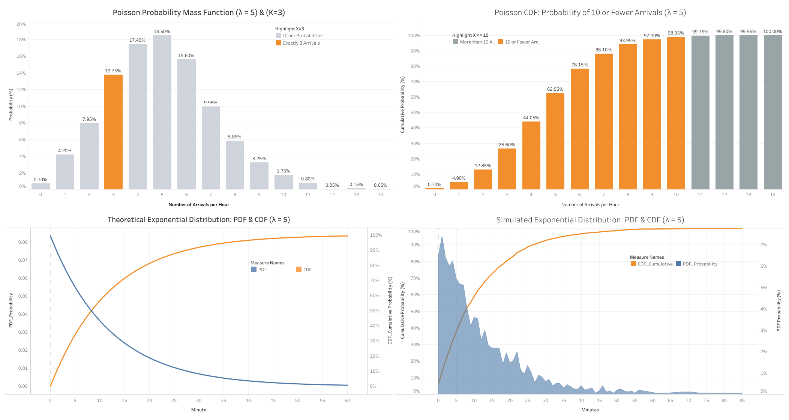

# Queueing Theory Simulation: Poisson & Exponential Distributions

## Project Overview
This project simulates customer arrival times and wait times to demonstrate the mathematical relationship between the Poisson distribution (discrete arrivals) and the Exponential distribution (continuous time between arrivals). 

## Interactive Dashboard
Click the image below to view the interactive Tableau dashboard:

## Technical Stack
* **Python (Jupyter Notebook):** Used to generate 2,000 simulated arrival events using `numpy` and calculate theoretical probabilities.
* **Pandas:** Used to format and export the simulated data into CSV files.
* **Tableau:** Used to construct dual-axis and blended-axis charts comparing empirical simulation data against theoretical probability mass/density functions.

## Key Statistical Concepts Visualized
1. **Poisson PMF:** The exact probability of receiving exactly K arrivals (K=3) given a rate of lambda=5.
2. **Poisson CDF:** The cumulative probability of receiving 10 or fewer arrivals.
3. **Exponential PDF & CDF:** The continuous mathematical decay of wait times and the cumulative probability curve. 
4. **Empirical vs. Theoretical:** A direct visual comparison proving that simulated continuous data (represented as an area chart) correctly aligns with theoretical pure-math formulas (represented as lines).

## Repository Files
* `simulation_code.ipynb`: The Jupyter Notebook containing the statistical generation logic.
* `exponential_simulated_2000.csv`: The output data for continuous wait times.
* `poisson_arrivals.csv`: The output data for discrete arrival counts.
